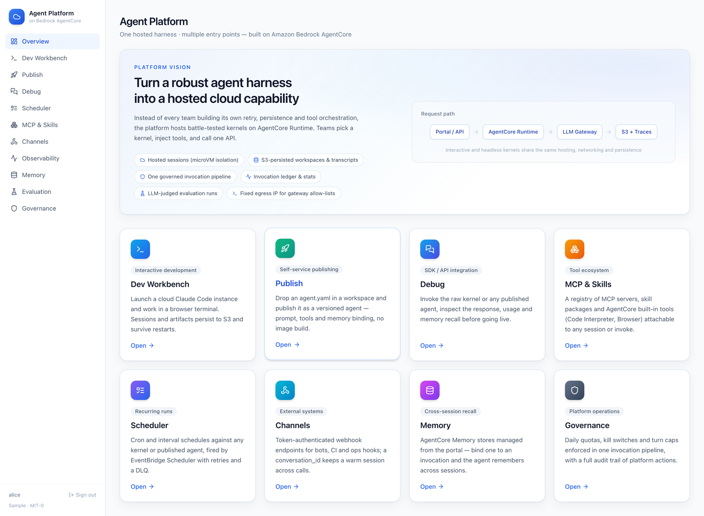
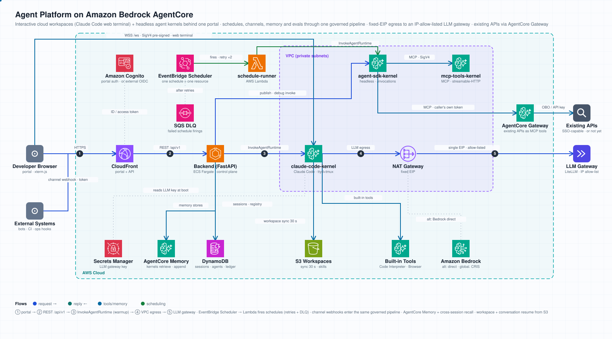

# Agent Platform with Amazon Bedrock AgentCore

A reference implementation of an **internal agent platform** built on
[Amazon Bedrock AgentCore](https://aws.amazon.com/bedrock/agentcore/).
It shows how a platform team can offer two hosting models behind one portal:

- **Interactive cloud workspaces** — launch a full Claude Code CLI inside an
  AgentCore Runtime and use it from a browser web terminal. The process lives
  in a persistent tmux session, so disconnecting or switching sessions keeps
  the conversation and in-flight work running; files and conversation history
  persist to S3 and survive container restarts.
- **Headless agent kernels** — publish Claude Agent SDK based agents as
  AgentCore Runtime endpoints that any application can invoke through a single
  `/invocations` contract.

Both kernels route model traffic through a configurable **LLM gateway**
(e.g. LiteLLM) with a **fixed egress IP** (VPC mode + NAT Gateway), so the
platform works in enterprises that enforce model allow-lists, budgets and
source-IP restrictions. Direct Bedrock access (cross-region inference) is
supported as an alternative.





## What's inside

```
├── runtimes/
│   ├── claude-code-kernel/   # Interactive kernel: web terminal (ttyd+tmux) + Claude Code + S3 workspace persistence
│   ├── agent-sdk-kernel/     # Headless kernel: Claude Agent SDK behind the AgentCore /invocations contract
│   └── mcp-tools-kernel/     # Demo MCP server (protocol=MCP): mock internal tools on AgentCore Runtime
├── backend/                  # FastAPI control plane: sessions, terminal URLs, kernel catalog, MCP/skill registry
├── frontend/                 # React portal: Workbench, Publish, Debug, Scheduler, MCP & Skills, Channels, Memory, Observability, Eval, Governance
├── infrastructure/           # CDK (Python): VPC/NAT network, platform resources, AgentCore runtimes, portal hosting + scheduler engine
├── scripts/                  # Image build & deployment helpers
└── docs/                     # Architecture, deployment, permissions, user guide
```

**Ecosystem (Phase 2)**: the portal keeps a registry of **MCP servers** (hosted
on AgentCore Runtime with `protocol=MCP`, reached via SigV4 through
`mcp-proxy-for-aws`, or any plain streamable-HTTP URL) and **skill packages**
(SKILL.md stored in S3). Attach them when creating a Dev Workbench session —
the kernel writes `.mcp.json` and mounts skills before Claude Code starts — or
pass both MCP servers and skills per-invocation to the headless kernel: the
same registry entry behaves identically in either hosting model.

**Built-in tools (Phase 3)**: the registry also ships two **AgentCore built-in
tools** — a **Code Interpreter** (isolated Python/shell sandbox) and a
**Browser** (managed cloud Chromium the agent drives via Playwright). Both are
wrapped as a local stdio MCP server inside each kernel, so they attach through
the exact same "kind" mechanism as any other MCP server and run against the
AWS-managed tool using the container's IAM role — no tool runtime of yours to
host.

**Platform operations (Phase 4)** — the rest of the portal's information
architecture, all live:

- **Self-service publish** — drop an `agent.yaml` manifest in a Dev Workbench
  workspace and publish it as a **versioned agent** (system prompt + tool
  attachments + memory binding, served by the shared headless kernel — no
  image build). Republish to bump the version; invoke from Debug, channels,
  schedules, evals or plain HTTP.
- **Scheduler** — cron / `rate(N minutes)` schedules against any kernel or
  published agent, fired by **EventBridge Scheduler → Lambda** (retries +
  DLQ), with an in-process tick loop as the local-development fallback.
- **Channels** — token-authenticated webhook endpoints for external systems
  (bots, CI, ops hooks); a `conversation_id` keeps a warm runtime session.
- **Memory** — AgentCore Memory stores managed from the portal; bind one to
  any headless invocation and the kernel retrieves relevant long-term records
  before the run and appends the exchange after it (recall across sessions).
- **Observability** — a platform invocation ledger (latency, turns, cost,
  source) over every governed call, complementing CloudWatch GenAI traces.
- **Evaluation** — fixed task suites executed against any target and scored
  by an LLM judge; compare a published agent against the raw kernel before
  rollout.
- **Governance** — daily quotas (per user + platform), per-source kill
  switches, turn caps, and an audit trail of every platform action. All
  invocation paths funnel through one governed pipeline.

See [docs/architecture.md](docs/architecture.md) for the full design, including
how the browser ⇄ AgentCore WebSocket terminal works — and
[docs/user-guide.md](docs/user-guide.md) for how to *use* the platform, page
by page (sessions, publishing agents, channels, memory, evals, quotas, and
calling the API from code).

## Prerequisites

- AWS account with Amazon Bedrock AgentCore available in your target region
- Docker with `linux/arm64` build support (AgentCore Runtime is ARM64)
- Node.js ≥ 20, Python ≥ 3.11, AWS CDK v2
- One of:
  - An Anthropic-compatible LLM gateway endpoint (e.g. LiteLLM) and an API key, or
  - Amazon Bedrock model access (Claude models via cross-region inference)

## Quick start

```bash
# 1. Provision network + platform resources
cd infrastructure
pip install -r requirements.txt
cdk deploy NetworkStack PlatformStack

# 2. Store your LLM gateway key (skip if using Bedrock direct)
aws secretsmanager put-secret-value \
  --secret-id agent-platform/llm-gateway-key \
  --secret-string '{"api_key":"sk-..."}'

# 3. Build & push runtime images (ARM64)
./scripts/build-and-push.sh

# 4. Create AgentCore runtimes (VPC mode, fixed egress IP)
cdk deploy RuntimeStack

# 5. Allow-list the NAT EIP on your LLM gateway, then run the portal
cdk deploy PortalStack        # or: run backend + frontend locally, see docs/deployment.md
```

Full walkthrough: [docs/deployment.md](docs/deployment.md). Once deployed,
hand users the [user guide](docs/user-guide.md); verify the deployment with
`scripts/e2e_platform.py` (20 automated end-to-end checks).

## Adapting this sample

This is meant to be forked. Point it at your environment with environment
variables and CDK context (no tracked code edits), and replace the starter
catalog by editing a single content-only module —
[`backend/app/services/seed_data.py`](backend/app/services/seed_data.py) — kept
separate from the seeding mechanism so upstream updates merge cleanly.
[**EXTENDING.md**](EXTENDING.md) maps the codebase into "what upstream owns" vs
"what is yours to change" and covers the upstream-sync workflow.

## Roadmap

Phase 1 covers interactive workspaces and headless kernel hosting; Phase 2
adds the MCP & Skills ecosystem (registry, session attachments, per-invoke
tools); Phase 3 wires in the AgentCore built-in tools (Code Interpreter +
Browser) through that same registry; Phase 4 ships the platform-operations
layer — self-service publishing, scheduler, channels, memory, observability,
evaluation and governance (scheduling runs on EventBridge Scheduler + Lambda).
Remaining ideas (image-based custom kernel publishing via CodeBuild,
CloudWatch GenAI dashboard deep links, DLQ alarming) are documented as
extension points in [EXTENDING.md](EXTENDING.md).

## Security

See [CONTRIBUTING.md](CONTRIBUTING.md#security-issue-notifications) for how to
report security issues.

The portal is guarded by an Amazon Cognito user pool (ID-token verification
on every API call). The web terminal grants a shell **inside the runtime
container**; isolation relies on AgentCore microVM session isolation plus the
VPC egress security group. Review [docs/architecture.md — Security notes](docs/architecture.md#security-notes)
before exposing the portal beyond a demo audience.

Deploying into a permission-controlled account? [**docs/permissions.md**](docs/permissions.md)
is the code-verified IAM reference — every role's exact actions and resource
scopes, the wildcard statements and why each is unavoidable, deployer
permissions, and how to tighten for a locked-down environment. Written for a
security team approving the deployment.

### Static-analysis suppressions

The repo is scanned by gitleaks, semgrep, checkov, bandit, grype, cfn-nag and
syft, plus GitHub code scanning (CodeQL) and Dependabot on the public
repository. The scan is clean; a small number of findings are suppressed
(tool-native comments, or a documented dismissal for CodeQL) because they are
by-design for this architecture or false positives. Each suppression carries
its reason; they are:

| Tool / rule | Where | Reason |
|---|---|---|
| bandit `B104` (bind 0.0.0.0) | `mcp-tools-kernel/src/server.py` | AgentCore's MCP contract requires the container to listen on `0.0.0.0:8000`; no other network path exists (microVM + VPC egress SG). |
| bandit `B108` (temp dir) | `agent-sdk-kernel/src/main.py` | Per-invocation scratch dir in an ephemeral, single-tenant microVM. |
| bandit `B106` (hardcoded password) | `infrastructure/stacks/platform_stack.py` | False positive — the string is a Secrets Manager secret *name*, not a credential. |
| semgrep `using-http-server` | `claude-code-kernel/contract-server/main.js` | AgentCore terminates TLS at the edge; the container listens plaintext on its single routed port. |
| semgrep `dockerfile-source-not-pinned` | all Dockerfiles | Pinning `FROM` to a digest would stop adopters from rebuilding with current base-image patches. |
| checkov `CKV_DOCKER_2` (HEALTHCHECK) | all Dockerfiles | Health is managed by AgentCore's `/ping` contract (or the ECS/ALB target group for the backend), not Docker HEALTHCHECK. |
| checkov `CKV_DOCKER_3` (non-root user) | all Dockerfiles | Runtime kernels run as root inside per-session AgentCore microVMs (Claude Code needs root in-sandbox); hardening is left to adopters for the backend. |
| semgrep JS/TS rules (i18n etc.) | `frontend/` (via `.semgrepignore`) | The reference portal is a single-language demo UI; internationalization is out of scope. Security logic lives in the backend and kernels, which are still scanned. |
| semgrep `arbitrary-sleep` | `scripts/e2e_platform.py` | Intentional poll intervals in the E2E test harness (waiting for async server-side work: eval runs, memory extraction, scheduler ticks). |
| semgrep `detect-non-literal-fs-filename` | `claude-code-kernel/contract-server/main.js` | The skill mount directory is a fixed prefix plus a name stripped to `[a-zA-Z0-9_-]` — no dots or slashes survive sanitization, so `../` traversal is impossible. |
| semgrep `dynamic-urllib-use-detected` | `scripts/e2e_platform.py` | Test harness only; the URL is the fixed https portal base plus literal API paths — no user-controlled input. |
| CodeQL `py/clear-text-logging-sensitive-data` | `agent-sdk-kernel/src/main.py` | False positive — the logged value is the Secrets Manager secret *name* (in a "could not read" error), not the secret value. Dismissed on GitHub with this reason. |

## License

This library is licensed under the MIT-0 License. See the [LICENSE](LICENSE) file.
