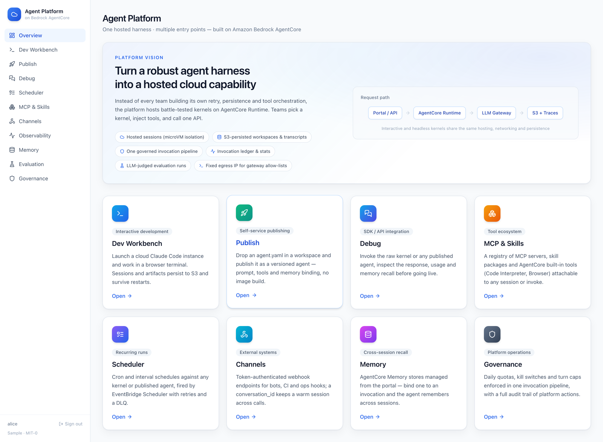
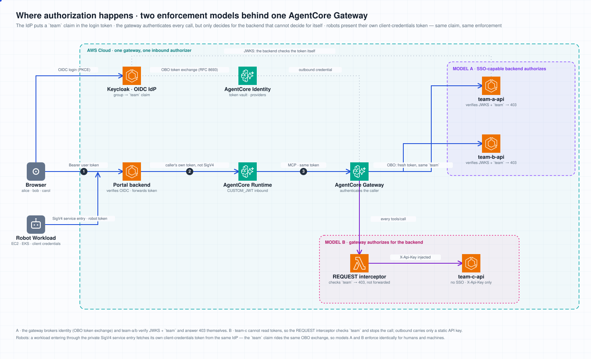

# Agent Platform with Amazon Bedrock AgentCore

Standing up an agent on [Amazon Bedrock AgentCore](https://aws.amazon.com/bedrock/agentcore/)
is no longer the hard part. This repository is a working answer to the
questions that come after it: what an internal agent platform looks like once
it has to fit an enterprise's existing identity, network, model-access and
operations constraints, and which parts of that AgentCore covers and which it
leaves to you.

The platform is deployed and in use. The design decisions below are the ones
we would make again, each with the requirement that forced it, what AgentCore
provides, the gap, and how this code closes it.

**The requirements it was built against**

- Users sign in through the enterprise IdP, and that identity has to decide
  what an agent may do in downstream systems, not just who reached the portal.
- Model traffic already goes through an LLM proxy (LiteLLM) with its own keys,
  budgets and allow-lists. That stays.
- Other workloads call agents from inside AWS, over private networking, with
  no long-lived shared secret.
- Developers want a real coding agent in a cloud workspace (Claude Code in a
  browser terminal), and teams want to publish agents without building images.
- Infrastructure is managed as code (Terraform), and pods authenticate with
  IRSA.



<!-- ?v= bumps the URL so GitHub's image cache serves the current diagram
     instead of a stale copy at the same path. Bump it whenever the SVG changes. -->


## Design decisions

| # | Decision | The hard part |
|---|---|---|
| 1 | [The signed-in user's identity decides what tools may do](#1-the-signed-in-users-identity-decides-what-tools-may-do) | Backends that cannot validate an IdP token, and teams that do not want Gateway on the tool path |
| 2 | [A private front door for workloads, separate from the console](#2-a-private-front-door-for-workloads-separate-from-the-console) | Adding and revoking callers without an IAM change each time |
| 3 | [The LLM proxy key never enters a runtime](#3-the-llm-proxy-key-never-enters-a-runtime) | The Workbench user is root in the container that needs model access |
| 4 | [Every invocation goes through one governed pipeline](#4-every-invocation-goes-through-one-governed-pipeline) | Six entry points, one answer to "who spent what, and can we stop it" |
| 5 | [Workflow scripts from the laptop run as governed cloud pipelines](#5-workflow-scripts-from-the-laptop-run-as-governed-cloud-pipelines) | Running an admin's arbitrary script on the pod that holds the platform's credentials |
| 6 | [Runtime platform version is chosen per workload](#6-runtime-platform-version-is-chosen-per-workload) | V2 is cheaper for some workloads and dearer for others, and the setting is per runtime |

Decision 3, workspace file access and session-id handling all follow from one
fact about the Workbench, covered after the list:
[the session user is root in its microVM](#one-fact-behind-three-of-these-decisions).

### 1. The signed-in user's identity decides what tools may do

**Requirement.** The same published agent should return different results to
different signed-in users, because the backend systems behind its tools grant
different users different data.

**What AgentCore provides.** AgentCore Gateway turns existing APIs into MCP
tools, authenticates the inbound caller (JWT or IAM), and can exchange the
user's token on the outbound side.

**The gap.** Authentication at the gateway is not authorization in the
backend. And some backends cannot validate an IdP token at all, while some
organizations do not want a managed service on the tool path.

**What this platform does.** The portal signs in against an external OIDC IdP
(Keycloak in the demo) and carries the team claim end to end, with three
enforcement options that coexist per tool:

- **Backend authorizes.** A backend that validates IdP tokens gets an
  OBO-exchanged token and enforces the team claim in its own code.
- **Gateway authorizes.** A backend with no SSO support sits behind a Lambda
  REQUEST interceptor that checks the claim, and receives a static API key
  outbound.
- **Your own MCP hub instead of Gateway.** An attachment of kind `mcp-hub`
  reaches a customer-owned hub. The kernel signs every request per application
  (`MCPHUB-HMAC-SHA256`, a published agent is one application) and forwards the
  user's token, so the hub answers "which application" and "which user"
  separately.

The identity reaches the kernel through the ordinary registry: an MCP server
whose header holds a `{{user_token}}` placeholder. Machine callers get the same
treatment by presenting their own client-credentials token (`x-robot-token`,
fetched by the workload; the platform never holds robot credentials), and an
agent whose tools need a verified identity fails closed when none arrives.




Details: [docs/enterprise-sso.md](docs/enterprise-sso.md),
[docs/mcp-hub-integration.md](docs/mcp-hub-integration.md).

### 2. A private front door for workloads, separate from the console

**Requirement.** Services in other VPCs call published agents. No public
endpoint, no shared bearer token to rotate, and adding or removing a caller
must not need a change request against IAM every time.

**What AgentCore provides.** `InvokeAgentRuntime`, authorized by IAM or JWT.

**The gap.** Giving every calling workload IAM permission on the runtime
itself puts per-agent access control in IAM policy, and gives callers a
direct path that bypasses quotas and the ledger. Front-door timeouts are also
shorter than agent runs.

**What this platform does.**

- A **private API Gateway** (`AWS_IAM`, PRIVATE endpoint type) reached through
  the caller's `execute-api` interface endpoint, then a VPC Link to an internal
  NLB. Nothing on this path touches the internet.
- **IAM admits a workload once**, API-wide. Each channel then lists the callers
  it accepts (deny by default, edited in the portal), so
  day-2 binding and revocation never go back through IAM. Creating a channel
  produces an SOP with the exact policy and Pod Identity steps for the caller's
  team to apply; the platform holds no IAM write permission.
- **Submit / poll** (202, then poll the invocation record), because agent runs
  outlive front-door timeouts.
- **The serving path is not the console.** The same backend image runs as two
  deployments: the management one behind CloudFront and user sign-in, and an
  entry-only one (`PLATFORM_ENTRY_ONLY=1`) that mounts nothing but the service
  entry. The NLB targets only the latter, so a bug in a console route is never
  reachable from the serving path, and the console can be scaled down or stopped without
  touching serving.
- The gateway relays the verified caller ARN plus a shared secret, so a
  neighbour inside the VPC (a runtime container above all) cannot reach the NLB
  with a forged identity.


Details: [docs/architecture.md § Platform operations](docs/architecture.md#platform-operations-phase-4).

### 3. The LLM proxy key never enters a runtime

**Requirement.** Model traffic goes through the organization's LiteLLM, which
issues virtual keys. Every runtime needs model access; nobody should be able to
take a key home.

**What AgentCore provides.** Runtime, Gateway, and Identity's token vault for
outbound credentials.

**The gap.** The obvious setup (key in a secret, read by the container)
hands the key to every Workbench user, because they are root in the container
([see below](#one-fact-behind-three-of-these-decisions)). An IAM condition on
the runtime role cannot help either: the role is shared by all sessions of
that runtime.

**What this platform does.** A kernel gets a short-lived grant minted per
session by the backend, never a credential of its own. Two backends implement
it, chosen per workload in Governance:

- **`agentcore_gateway` (recommended).** AgentCore Gateway fronts LiteLLM with
  an inference target, and the LiteLLM key lives in AgentCore Identity's token
  vault. The platform side holds no key and runs no broker.

  What a session holds instead is its own IAM identity: STS credentials whose
  role session name is the runtime session id, narrowed by a session policy to
  this one gateway. Because the identity is per session, so is revocation: an
  IAM Deny matching that session's `aws:userid`. The kernel role itself is
  explicitly denied the gateway, so the shared role is no way around it.

  One detail decides how long such a grant can live. The backend gets it with
  `AssumeRoleWithWebIdentity` straight from its pod's IRSA token. Assuming the
  caller role from the backend's own role would be role chaining, which STS
  caps at one hour; as a first hop the grant covers async runs of up to nine.

  The network path is private end to end: runtime → gateway over PrivateLink,
  gateway → LiteLLM over a managed VPC Lattice path, so LiteLLM needs no
  public endpoint.
- **`llm-edge` (`litellm`).** A platform-side service holds the key and
  forwards session-scoped calls, restricted to inference routes and an
  allow-listed header set. Runtimes egress through a NAT Gateway with a fixed
  EIP that goes on LiteLLM's source-IP allow-list.

Direct Bedrock (cross-region inference, no key of any kind) remains an option.
The backend is resolved per workload at every invocation or connect, from a
`(backend, model)` reference on the published agent or Workbench session, so
changing the default in Governance takes effect without a deployment.
One limit matters to anyone copying the private path: VPC Lattice closes a
connection after 350 seconds without data, silently, so non-streaming calls
that take longer never return. Claude Code and the SDK kernel always stream.


Details: [every hop of the private path](docs/architecture.md#how-the-agentcore_gateway-backend-reaches-a-private-litellm).

### 4. Every invocation goes through one governed pipeline

**Requirement.** Six ways in (Debug console, published-agent API, channels,
schedules, evaluations, and workflows on top of them) and one answer to "who
spent what, and can we stop it".

**What AgentCore provides.** Per-runtime metering and observability.

**The gap.** Cost and limits per user, per entry point, and per published
agent are platform concepts AgentCore does not know about.

**What this platform does.** Every headless call goes through
`invocation_service`: resolve the target → governance check (daily quotas per
user and platform as atomic counters, per-source kill switches, turn caps) →
invoke → invocation ledger (source, target, latency, turns, cost, runtime
version). A new entry point inherits all of it by calling the same function,
and there is no second path into a runtime that skips the checks.

"Can we stop it" also has a narrower meaning: who may stop whose job.
Platform administrators share the management pages but each owns their own
schedules, so one operator cannot pause another's production run; a
super-administrator tier sees all of them. Every mutating action lands in an
append-only audit log.

Details: [docs/architecture.md § Platform operations](docs/architecture.md#platform-operations-phase-4),
[docs/observability.md](docs/observability.md).

### 5. Workflow scripts from the laptop run as governed cloud pipelines

**Requirement.** Multi-agent jobs (fan out research, verify, synthesize) that
someone prototyped locally should run on a schedule in the cloud, under the
same limits and the same bill as everything else.

**What AgentCore provides.** One agent per runtime session, synchronous up to
15 minutes or as an async task up to 8 hours.

**The gap.** Orchestration across sessions, and running someone's
orchestration script next to the platform's own credentials.

**What this platform does.** A pipeline is a script in the same dialect as the
Claude Code Workflow tool (`agent()`, `parallel()`, `pipeline()`, `phase()`),
so a local orchestration ports nearly verbatim. The script runs in a
short-lived Node child process whose only I/O is a stdio bridge back to the
engine:

- every `agent()` call is a governed invocation (decision 4), against a
  published agent or the raw kernel, fanned out up to an engine-side cap
  (`MAX_FANOUT`) with the rest queued;
- S3 access goes through the bridge and stays inside the workspace bucket;
- the child never sees the backend's AWS identity: an allow-listed
  environment, Node's permission model (no `child_process`, workers or addons,
  no read access beyond the runner and the script, so the IRSA token file is
  out of reach), and an unprivileged user;
- a run is one trace, run → phase → agent → the kernel's own `AGENT` / `TOOL`
  spans, and the Insights page reads per-run health checks and funnels that the
  script itself reports;
- `pipeline:{name}` is a schedule target like any agent.

The engine is marked experimental in the portal: the dialect may still change.


Details: [docs/architecture.md § Workflow engine](docs/architecture.md#workflow-engine--pipeline-as-data-phase-5-experimental).

### 6. Runtime platform version is chosen per workload

**Requirement.** AgentCore Runtime V2 restores each session from a snapshot,
so cold start drops to about two seconds, but it costs more per unit. A
pipeline call with a long idle tail tends to come out cheaper on V2; a
long-lived interactive terminal may not.

**The gap.** `platformVersion` is a property of the runtime itself, not of a
session or an endpoint, so one runtime cannot serve both.

**What this platform does.** The interactive and headless kernels each deploy
as two runtimes from the same image. A Workbench session picks its version at
creation and keeps it; a published agent stores its choice (or follows the
platform default), and pipelines, schedules and channels calling it inherit
it. The ledger and traces record the version each call actually ran on, so
cost can be split by version.

V2 is not a drop-in switch for the code inside the container. Every session
restores the same snapshot, so a random value or timestamp computed at startup
is the same in every restored instance: two sessions would mint the same ids,
and a timer measured from boot starts from the snapshot's clock. The kernels
were changed to draw entropy per request and to stop deriving deadlines from
start-up time before they ran on V2. Any kernel added to this platform needs
the same review.

Details: [docs/architecture.md § Platform versions](docs/architecture.md#platform-versions-v1--v2).

### One fact behind three of these decisions

The Dev Workbench gives a user a real terminal in the session's microVM, and
the user is root there. The headless kernel is no different in principle: the
Agent SDK runs tools in a CLI subprocess. So everything in a runtime
container (environment, files, process memory, and the execution role's
credentials from the metadata endpoint) is visible to that session's user.

The rule that follows is that a runtime role may hold only what the session's
user is entitled to anyway. Three designs apply it:

- **Model access** (decision 3): a per-session grant instead of a key.
- **Workspace files**: the kernel role has no access to `workspaces/*`. The
  backend, which owns the session ↔ user mapping, mints S3 credentials whose
  session policy is pinned to `workspaces/{sessionId}/*`.
- **The session id itself**: reusing an AgentCore `runtimeSessionId` lands on
  the same warm microVM, with its files and in-process grants. So a
  client-supplied session id is bound to the authenticated caller by HMAC
  before it reaches AgentCore; the same id from another caller lands in a
  different session.


Details: [docs/permissions.md](docs/permissions.md) (every role, written for a
security review).

## What's inside

```
├── runtimes/
│   ├── claude-code-kernel/   # Interactive kernel: web terminal (ttyd+tmux) + Claude Code + S3 workspace persistence
│   ├── agent-sdk-kernel/     # Headless kernel: Claude Agent SDK behind the AgentCore /invocations contract
│   └── mcp-tools-kernel/     # Demo MCP server (protocol=MCP): mock internal tools on AgentCore Runtime
├── backend/                  # FastAPI control plane: sessions, terminal URLs, kernel catalog, MCP/skill registry, workflow engine
├── frontend/                 # React portal: Workbench, Publish, Debug, Scheduler, MCP & Skills, Gateway, Channels, Memory, Observability, Eval, Workflow, Governance
├── services/                 # llm-edge (key holder for the `litellm` backend) + the optional Keycloak IdP and team APIs
├── terraform/                # Terraform (the maintained path): network, platform resources, AgentCore runtimes, EKS, portal hosting + scheduler engine
├── infrastructure/           # CDK (Python): the legacy ECS Fargate variant of the same stacks, kept for reference
├── deploy-cli/               # AWS-CLI-only deployment port for accounts that cannot run Terraform or CDK
├── pipelines/                # Sample Workflow-dialect pipeline scripts
├── demo/                     # Standalone tryouts (invoke a kernel from your terminal, EKS Pod Identity caller)
├── scripts/                  # Image build, deployment and end-to-end test helpers
└── docs/                     # Architecture, deployment, permissions, user guide
```

What the portal offers, in one table (the [user guide](docs/user-guide.md)
walks through each page):

| Area | What it does |
|---|---|
| **Dev Workbench** | Claude Code CLI in an AgentCore Runtime, in a browser terminal. tmux keeps work running across disconnects; files and conversation history persist to S3. |
| **Headless kernel** | Claude Agent SDK behind the `/invocations` contract, invocable by any application. |
| **MCP & Skills** | Registry of MCP servers (AgentCore Runtime `protocol=MCP` via SigV4, AgentCore Gateway, an MCP hub, or any streamable-HTTP URL) and SKILL.md packages in S3; attach to a Workbench session or per invocation. Code Interpreter and Browser built-in tools attach the same way. |
| **Publish** | An `agent.yaml` in a Workbench workspace becomes a versioned agent served by the shared headless kernel. No image build. |
| **Scheduler** | cron / `rate()` schedules on EventBridge Scheduler → Lambda (retries + DLQ), against agents, kernels or pipelines. |
| **Channels** | Token webhooks, and the private IAM service entry (decision 2). A `conversation_id` keeps a warm session and a separate memory history per conversation. |
| **Memory** | AgentCore Memory stores; bound invocations retrieve long-term records and replay the last 10 turns, so conversations survive microVM recycling. |
| **Observability · Eval · Governance** | Invocation ledger and per-run traces; LLM-judged task suites against any target; quotas, kill switches, model backends and the audit log. |
| **Workflow** *(experimental)* | Workflow-dialect pipelines (decision 5) with a live trace view and an Insights page. |

## Prerequisites

- AWS account with Amazon Bedrock AgentCore available in your target region
- Docker with `linux/arm64` build support (AgentCore Runtime is ARM64; the
  platform services run on Graviton EKS nodes and share the arm64 build)
- Node.js ≥ 20, Python ≥ 3.11, Terraform ≥ 1.9, `kubectl` + `helm` to operate
  the cluster
- One of:
  - An Anthropic-compatible LLM gateway endpoint (e.g. LiteLLM) and an API key, or
  - Amazon Bedrock model access (Claude models via cross-region inference)

## Quick start

```bash
# 1. Provision network + platform resources
cd terraform
cp terraform.tfvars.example terraform.tfvars   # then edit
terraform init
terraform apply -var enable_runtime=false -var enable_portal=false

# 2. Model backend. Pick one (docs/deployment.md §2):
#    - agentcore_gateway: create the AgentCore Gateway + LiteLLM inference
#      target and the per-session caller role (Option A2). No key on this side;
#      set enable_gateway_vpce = true to keep runtime -> gateway on PrivateLink.
#    - litellm via llm-edge: enable_llm_edge = true and store the key, which is
#      readable only by llm-edge and never enters a kernel container:
aws secretsmanager put-secret-value \
  --secret-id agent-platform/llm-gateway-key \
  --secret-string '{"api_key":"sk-..."}'
#    - Bedrock direct: nothing to store.

# 3. Build & push the images (ARM64)
../scripts/build-and-push.sh

# 4. (llm-edge only) allow-list the NAT EIP on your LLM gateway. Then create the AgentCore
#    runtimes (VPC mode, fixed egress IP), the EKS cluster and the portal
terraform apply               # or: run backend + frontend locally, see docs/deployment.md
../scripts/deploy-frontend.sh
```

The containers (backend, llm-edge if enabled, and the optional Keycloak + team APIs) run
on a dedicated EKS cluster with Graviton nodes; every pod authenticates to AWS
through IRSA and carries its own security group. The CDK stacks in
`infrastructure/` are the legacy ECS Fargate variant, kept for reference.

Full walkthrough: [docs/deployment.md](docs/deployment.md). Once deployed,
hand users the [user guide](docs/user-guide.md); verify the deployment with
`scripts/e2e_platform.py`, which drives the Phase 4 surface (publish,
scheduler, channels, memory, eval, governance) against the live portal and
prints a pass/fail line per check.

## Adapting this sample

This is meant to be forked. Point it at your environment with Terraform
variables and environment variables (no tracked code edits), and replace the
starter catalog by editing a single content-only module —
[`backend/app/services/seed_data.py`](backend/app/services/seed_data.py) — kept
separate from the seeding mechanism so upstream updates merge cleanly.
[**EXTENDING.md**](EXTENDING.md) maps the codebase into "what upstream owns" vs
"what is yours to change" and covers the upstream-sync workflow.

## Roadmap

Phase 1 covers interactive workspaces and headless kernel hosting; Phase 2
adds the MCP & Skills ecosystem (registry, session attachments, per-invoke
tools); Phase 3 wires in the AgentCore built-in tools (Code Interpreter +
Browser) through that same registry; Phase 4 ships the platform-operations
layer — self-service publishing, scheduler, channels, memory, observability,
evaluation and governance (scheduling runs on EventBridge Scheduler + Lambda).
Phases 1–4 are live. **Phase 5 — the workflow engine (pipeline-as-data)** —
is in the tree and usable, but shipped as **experimental**: the portal page
carries an *Exp* badge and the script dialect may still change.

Remaining ideas (image-based custom kernel publishing via CodeBuild,
CloudWatch GenAI dashboard deep links, DLQ alarming) are documented as
extension points in [EXTENDING.md](EXTENDING.md).

## Security

See [CONTRIBUTING.md](CONTRIBUTING.md#security-issue-notifications) for how to
report security issues.

The portal is guarded by an Amazon Cognito user pool by default (ID-token
verification on every API call), or by an external OIDC IdP as in
[decision 1](#1-the-signed-in-users-identity-decides-what-tools-may-do). Portal
APIs are role-gated: platform admins see the whole catalog and the admin pages,
developers see what they created. The web terminal grants a shell **inside the
runtime container**; isolation relies on AgentCore microVM session isolation,
the per-session grants described
[above](#one-fact-behind-three-of-these-decisions), and the VPC egress security
group. Review [docs/architecture.md — Security notes](docs/architecture.md#security-notes)
before exposing the portal beyond a demo audience.

Five E2E suites under `scripts/` cover the security-relevant paths:
`e2e_platform.py` (platform operations), `e2e_team_auth.py` (the SSO chain end
to end), `e2e_gateway_identity.py` (same agent, different signed-in user),
`e2e_service_entry.py` (private SigV4 entry + robot identity) and
`e2e_mcp_hub.py` (customer-owned MCP hub).

Deploying into a permission-controlled account? [**docs/permissions.md**](docs/permissions.md)
is the code-verified IAM reference — every role's exact actions and resource
scopes, the wildcard statements and why each is unavoidable, deployer
permissions, and how to tighten for a locked-down environment. Written for a
security team approving the deployment.

### Static-analysis suppressions

The repo is scanned by gitleaks, semgrep, checkov, bandit, grype, cfn-nag and
syft, plus GitHub code scanning (CodeQL) and Dependabot on the public
repository. The scan is clean; a small number of findings are suppressed
(tool-native comments, or a documented dismissal for CodeQL) because they are
by-design for this architecture or false positives. Each suppression carries
its reason; they are:

| Tool / rule | Where | Reason |
|---|---|---|
| bandit `B104` (bind 0.0.0.0) | `mcp-tools-kernel/src/server.py` | AgentCore's MCP contract requires the container to listen on `0.0.0.0:8000`; no other network path exists (microVM + VPC egress SG). |
| bandit `B108` (temp dir) | `agent-sdk-kernel/src/main.py` | Per-invocation scratch dir in an ephemeral, single-tenant microVM. |
| bandit `B106` (hardcoded password) | `infrastructure/stacks/platform_stack.py` | False positive — the string is a Secrets Manager secret *name*, not a credential. |
| semgrep `using-http-server` | `claude-code-kernel/contract-server/main.js` | AgentCore terminates TLS at the edge; the container listens plaintext on its single routed port. |
| semgrep `dockerfile-source-not-pinned` | all Dockerfiles | Pinning `FROM` to a digest would stop adopters from rebuilding with current base-image patches. |
| checkov `CKV_DOCKER_2` (HEALTHCHECK) | all Dockerfiles | Health is managed by AgentCore's `/ping` contract (or the Kubernetes probes and ALB target group for the services), not Docker HEALTHCHECK. |
| checkov `CKV_DOCKER_3` (non-root user) | all Dockerfiles | Runtime kernels run as root inside per-session AgentCore microVMs (Claude Code needs root in-sandbox); hardening is left to adopters for the backend. |
| semgrep JS/TS rules (i18n etc.) | `frontend/` (via `.semgrepignore`) | The reference portal is a single-language demo UI; internationalization is out of scope. Security logic lives in the backend and kernels, which are still scanned. |
| semgrep `arbitrary-sleep` | `scripts/e2e_platform.py` | Intentional poll intervals in the E2E test harness (waiting for async server-side work: eval runs, memory extraction, scheduler ticks). |
| semgrep `detect-non-literal-fs-filename` | `claude-code-kernel/contract-server/main.js` | The skill mount directory is a fixed prefix plus a name stripped to `[a-zA-Z0-9_-]` — no dots or slashes survive sanitization, so `../` traversal is impossible. |
| semgrep `dynamic-urllib-use-detected` | `scripts/e2e_platform.py` | Test harness only; the URL is the fixed https portal base plus literal API paths — no user-controlled input. |
| CodeQL `py/clear-text-logging-sensitive-data` | `agent-sdk-kernel/src/main.py` | False positive — the logged value is the Secrets Manager secret *name* (in a "could not read" error), not the secret value. Dismissed on GitHub with this reason. |
| CodeQL `py/clear-text-logging-sensitive-data` | `scripts/seed_team_idp.py`, `scripts/deploy_team_gateway.py`, `scripts/e2e_team_auth.py` | False positives — the flagged prints log secret/credential-provider *names* and the public OIDC issuer URL (CodeQL taints anything derived from `SecretString`); no password or key value is ever printed. Dismissed on GitHub with per-alert reasons. |

## License

This library is licensed under the MIT-0 License. See the [LICENSE](LICENSE) file.
