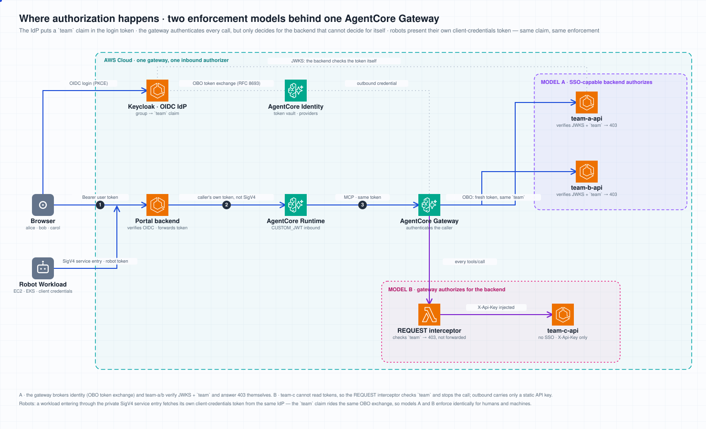

# Enterprise SSO auth chain (team-auth demo)

This optional layer rebuilds the platform's authentication around an
**external OIDC IdP** and demonstrates the property security teams usually
ask for first: *the identity your IdP mints at login — including group /
team membership — travels, verifiably, all the way to the backend API that
serves the data, and the backend enforces authorization itself.* It also
covers the inevitable exception: a **newly built backend that has no SSO
support yet** (team-c), where AgentCore's gateway Lambda interceptor
enforces the same team claim *for* the backend until it catches up.

```
browser ──► Keycloak login (alice ∈ team-a, bob ∈ team-b, carol ∈ team-c)
   │ access token (`team` claim; aud: agent-platform, gateway-delegate)
   ▼
AgentCore Runtime  team_demo_kernel      · CUSTOM_JWT inbound (Keycloak JWKS)
   │ same token as MCP Authorization
   ▼
AgentCore Gateway  agent-platform-team   · CUSTOM_JWT inbound
   │                                     · Lambda REQUEST interceptor gates
   │                                       team-c___* tool calls on the
   │                                       (gateway-verified) `team` claim
   ├─► team-a-api / team-b-api (ECS)     · OBO token exchange (RFC 8693) at
   │     Keycloak per tool call: fresh token — same `sub`, same `team` —
   │     and the backends validate JWKS + enforce `team` THEMSELVES
   │     → 403 across teams (app-layer authorization)
   └─► team-c-api (ECS, NO SSO support)  · gateway injects a static X-Api-Key
         (API-key credential provider); team authorization already happened
         in the interceptor — AgentCore enforces what the backend cannot
```

## Where authorization happens



Authentication and authorization sit in different places here, and conflating
them is what makes these setups confusing:

- **Authentication is always the gateway's job.** One gateway, one inbound
  authorizer. Every call arrives with the IdP's access token and the gateway
  validates signature, issuer and audience before anything else runs. No
  backend, and no interceptor, re-does that work.
- **Authorization — the allow/deny decision — belongs wherever the *identity*
  can still be read.** That is what splits the two models below.

| | **Model A** — backend speaks SSO | **Model B** — backend has no SSO |
|---|---|---|
| Example | `team-a-api`, `team-b-api` | `team-c-api` |
| Outbound credential | OAuth **token exchange** (RFC 8693) | static **API key** |
| Does the backend receive the user's identity? | Yes — a fresh token, same `sub` and `team` | No — the key says nothing about who called |
| Who decides allow/deny | **The backend**, in its own code | **The gateway**, in a Lambda REQUEST interceptor |
| A denial is | `403` from the service | a JSON-RPC error; the backend is never called |
| The rule lives in | your service (`services/team-api/src/server.py` here) | the interceptor (`scripts/deploy_team_gateway.py`) |
| Audit trail | your service logs | the interceptor's CloudWatch logs |
| Migrating later | — | swap the target to token exchange; nothing upstream changes |

**Which one applies to your backend?** One question: *can it validate a token
from your IdP and read the group claim?* If yes, use Model A — keep the rule
where the domain logic already is, and the gateway stays a broker. If no
(a new service, a legacy service, a vendor endpoint you cannot modify),
Model B lets you ship it now with the same enforcement, because AgentCore
decides on the backend's behalf.

Both models coexist on one gateway, per target — this is a target-level
choice, not a gateway-level one.

**Do not look for the rule in the AgentCore console.** In Model A, AgentCore
holds no authorization configuration at all: dump `get-gateway-target` for
`team-a` and `team-b` and the two are byte-identical (same gateway, same
authorizer, same credential provider, same grant type). What makes alice's
call succeed and bob's fail is her IdP group membership plus the backend's
own check. Model B is the only case that leaves a trace in AgentCore — an
API-key credential provider and an attached interceptor — and even that is
API/CLI-only configuration today, so the console shows the credential but not
the interceptor. The portal's **Gateway** page reports both.

Design decisions:

- **Authorization lives in the application layer — when the backend can do
  it.** The gateway performs no allow/deny logic for team-a/b — it
  authenticates the caller and brokers identity. The team APIs validate the
  token against the IdP's JWKS and check the `team` claim, exactly like an
  existing SSO-protected corporate backend. Swapping in a real backend means
  changing nothing in the gateway.
- **AgentCore covers the backends that can't (yet).** team-c models a newly
  built internal API with no SSO adaptation: it cannot validate IdP tokens
  at all. Its team authorization runs in the gateway's **Lambda REQUEST
  interceptor**, which reads the `team` claim from the inbound JWT (already
  signature/issuer/audience-verified by the gateway's authorizer) and
  short-circuits unauthorized `tools/call`s with a JSON-RPC error — the
  request never reaches the backend. Outbound, an **API-key credential
  provider** injects the service's static `X-Api-Key`, so the auth-less
  endpoint still rejects direct callers. When the backend later gains SSO
  support, migrating it to the team-a/b pattern is a target-level change;
  nothing upstream moves.
- **OBO token exchange, not token passthrough.** MCP-server gateway targets
  do not support `JWT_PASSTHROUGH` (the API rejects it; it is limited to
  AgentCore Runtime targets). Token exchange is the documented production
  pattern anyway: the backend receives a fresh, audience-scoped token that
  still carries the user's `sub` and `team`, instead of a replay of the
  login token.
- **The standard runtimes are untouched.** A runtime has exactly one inbound
  authorizer, and every existing portal feature (terminal WebSocket,
  scheduler, channels) is built on SigV4 — so the user-identity path gets
  its own runtime (`TeamDemoStack`, same headless kernel image).
- **Portal auth becomes pluggable.** `PLATFORM_OIDC_ISSUER` switches the
  backend to generic-OIDC verification (access token, PKCE flow in the
  frontend); Cognito mode still works and remains the fallback for
  platform-internal callers (the schedule-runner Lambda's portal-admin
  delegation authenticates against Cognito even in OIDC mode).

## Components

| Piece | What it is |
|---|---|
| `AgentPlatformTeamAuth` stack | Keycloak (Fargate, dev mode) + `team-a-api`/`team-b-api`/`team-c-api` containers behind one ALB + CloudFront (HTTPS for the OIDC discovery URL); generates the team-c static key (`agent-platform/team-c-api-key`) |
| `AgentPlatformTeamDemo` stack | The JWT-inbound runtime (`team_demo_kernel`) |
| `services/keycloak/` | Keycloak image with the realm baked in: groups, users (alice/bob/carol), `portal-web` (public, PKCE) and `gateway-delegate` (confidential, standard token exchange) clients, `team`/audience mappers |
| `services/team-api/` | One image; `TEAM` selects the team, `TEAM_API_AUTH` the authz depth: `oidc` (JWKS-validating middleware, `tools/call` team-gated, catalog stays listable) or `api-key` (static `X-Api-Key` check only — the no-SSO backend) |
| `scripts/seed_team_idp.py` | Sets user passwords + pins the delegate client secret (Secrets Manager ⇄ Keycloak) — re-run after any Keycloak restart (dev mode is in-memory) |
| `scripts/deploy_team_gateway.py` | Gateway + OAuth2 credential provider (token exchange) + API-key credential provider + the Lambda REQUEST interceptor (inline zip) + three MCP-server targets + the gateway service-role policy; wiring goes to SSM `/agent-platform/team-gateway` |
| `scripts/e2e_team_auth.py` | The acceptance suite for the auth chain (20 checks, below) |
| `scripts/seed_team_gateway_registry.py` | Registers the gateway as one **MCP server** in the platform registry (headers carry the `{{user_token}}` placeholder) and publishes the `team-access-tester` agent with it attached |
| `scripts/e2e_gateway_identity.py` | Acceptance suite for the platform paths (15 checks): the same published agent invoked by two identities reaches different backends |
| **Gateway** page (portal) | Read-only inventory of every gateway in the account: inbound authorizer, interceptors, per-target outbound credential, and whether the MCP endpoint is reachable for the signed-in user (the catalog is listed with their token, so it is the tool set their agents will see) |
| `POST /api/v1/team-demo/invoke` | Backend route that forwards the **caller's own token** to the JWT runtime (no SigV4) with the gateway attached as MCP |

## Deploy runbook

```bash
# 0. prerequisites: NetworkStack/PlatformStack deployed (PlatformStack owns the ECR repos)
cdk deploy AgentPlatformPlatform

# 1. build + push the IdP and team API images (linux/arm64)
./scripts/build-and-push-team-auth.sh

# 2. IdP + team APIs + CloudFront
cdk deploy AgentPlatformTeamAuth

# 3. seed users + pin the delegate secret (re-run after any Keycloak restart)
python3 scripts/seed_team_idp.py

# 4. gateway + OBO credential provider + targets (idempotent)
python3 scripts/deploy_team_gateway.py

# 5. the JWT-inbound runtime (needs the kernel image with mcp_servers[].headers
#    support — see team_demo_image_tag in cdk.json)
cdk deploy AgentPlatformTeamDemo
python3 scripts/deploy_team_gateway.py     # re-run: records the runtime ARN in SSM

# 6. switch the portal to OIDC (context in cdk.json: oidc_issuer=<Keycloak realm URL>)
cdk deploy AgentPlatformPortal && ./scripts/deploy-frontend.sh

# 7. make it a platform capability, not a demo: register the gateway in the
#    MCP registry and publish an agent that uses it
PLATFORM_AWS_REGION=<region> PLATFORM_DYNAMO_TABLE=agent-platform \
  PLATFORM_WORKSPACE_BUCKET=agent-platform-workspaces-<account>-<region> \
  python3 scripts/seed_team_gateway_registry.py

# 8. acceptance
python3 scripts/e2e_team_auth.py --portal-url https://<portal-distribution>.cloudfront.net
PORTAL_URL=https://<portal-distribution>.cloudfront.net python3 scripts/e2e_gateway_identity.py
```

## Using it from the platform (no demo-only surface)

Once step 7 has run, the gateway is an ordinary registry entry and nothing in
the product knows about "teams":

- **MCP & Skills** lists `team-apis-gateway` like any other MCP server. Its
  stored header is `Authorization: Bearer {{user_token}}` — a *placeholder*.
  The invocation pipeline substitutes the calling user's own token per
  request (`app/context.py`), so no credential is ever persisted and every
  attachment automatically carries the caller's identity.
- **Publish** holds `team-access-tester`, an agent whose only special
  property is that attachment. Invoke it from **Debug**, a channel, a
  schedule or plain HTTP.
- **Debug**, signed in as different users: the same agent reports different
  reachable backends. alice (team-a) gets team-a data and authorization
  errors for the rest; carol (team-c) gets team-c data — served by a backend
  with no SSO support at all, admitted by the gateway interceptor.
- **Gateway** shows why: per target, the outbound credential and therefore
  where authorization is decided (OAuth token exchange → the backend decides;
  API key → the interceptor decides). It also confirms the endpoint is
  reachable and lists the tools *your* identity resolves — running them is the
  agent's job, so there is no tool-runner surface in the portal.
- The **sidebar** shows who you are signed in as and the group claims the
  backend verified, which is the variable that changes the answers above.

Internal callers (scheduler, token channels) have no end-user token, so
attaching an identity-forwarding server there fails fast with a 400
explaining exactly that, instead of silently calling a backend with no
identity.

## Robot identity for server-side workloads (path A)

The one internal caller that *can* carry an identity is the IAM service
entry: a workload (an EKS pod, say) holds **its own service account in the
IdP** — the `robot-order-service` client here, a confidential
client-credentials client whose service-account user is a member of
`/team-a` — and sends the token it fetched as the `x-robot-token` header on
service-entry calls (SigV4 owns `Authorization`, so the robot token rides
its own header).

The two credentials answer different questions and neither replaces the
other: **SigV4 (EKS Pod Identity) authenticates the infrastructure** — is
this pod's role allowed to reach this channel — while **the robot token
authenticates the business identity** — which service is calling, and which
teams' APIs it may reach. The backend verifies the token against the
platform's OIDC issuer (fail fast on anything invalid), then makes it the
caller token for the run, so `{{user_token}}` forwarding, the gateway's OBO
exchange and the team APIs' own `team`-claim checks all treat the robot
exactly like a signed-in user. The credentials stay with the workload (a
K8s secret in the demo) — the platform never stores them; that is the
deliberate choice of path A.

Provisioning is part of `seed_team_idp.py`: it pins the robot client secret
to Secrets Manager (`agent-platform/robot-order-service`) and applies the
service-account user's group membership, which a Keycloak realm import
cannot express. `demo/eks-pod-identity/` contains a complete workload that
exercises the whole chain from a pod.

## E2E acceptance matrix

`scripts/e2e_team_auth.py` asserts, with real tokens for all three users:

| Group | Checks |
|---|---|
| IdP | alice/bob/carol password grants; token carries the right `team` claim |
| Gateway | unauthenticated `tools/list` → 401; catalog aggregates all three targets (pagination-aware); `*_whoami` returns the caller's verified IdP identity from the team-a/b backends — and the team-c backend's honest "no SSO here, the interceptor authorized you"; **cross-team `tools/call` denied — by the backend for team-a/b (both directions), by the gateway Lambda interceptor for team-c (403 with an explicit interceptor message)** |
| Direct | the no-SSO team-c endpoint rejects calls lacking the gateway-injected API key |
| Runtime | unauthenticated invoke → 401; agents reach their own team's tools through the gateway (team-a *and* team-c); cross-team tool denied end to end with no data leak |
| Portal | `auth_mode=oidc`; `/api/v1/team-demo/invoke` works with the user's token; invalid token → 401 |

## Operational notes (hard-won)

1. **Keycloak standard token exchange requires the exchanging client to be in
   the subject token's audience.** The `portal-web` client therefore carries
   an audience mapper that adds `gateway-delegate` to login tokens; without
   it Keycloak answers `access_denied: Client is not within the token
   audience`.
2. **The gateway service role needs more than the documented sample policy.**
   A JWT-inbound gateway calls `bedrock-agentcore:GetWorkloadAccessTokenForJWT`
   (not just `GetWorkloadAccessToken`), and IAM evaluates
   `bedrock-agentcore:GetResourceOauth2Token` against the gateway's
   **workload identity** ARN as well as the credential provider.
   `deploy_team_gateway.py` attaches the full policy. Symptom of a gap:
   `Token exchange failed` on every call, with nothing reaching the IdP.
3. **MCP-server targets with token exchange must use `listingMode: DYNAMIC`**
   (an upfront `mcpToolSchema` is only allowed for the authorization-code
   grant). The gateway then lists tools live, per caller — and pages
   `tools/list` one target per page, so follow `nextCursor`.
4. **Pin the model to a `global.` inference profile.** Regional
   (`apac.`/`us.`) Claude inference profiles can disappear; when
   `ANTHROPIC_MODEL` is unset the CLI picks a regional default and every
   invocation fails in about a second with
   `Claude Code returned an error result`. `cdk.json` sets
   `anthropic_model` explicitly for all runtimes.
5. **Keycloak dev mode is in-memory.** Every task restart re-imports the
   realm from the image and loses passwords — re-run `seed_team_idp.py`.
   The delegate client secret survives restarts because the seed script
   pins the Secrets Manager value back into Keycloak.
6. **Kernel images should pin `claude-agent-sdk`.** A rebuild that silently
   picks up a newer SDK can change CLI bundling behavior; the deployed tags
   (`v14`/`v15`) are pinned builds.
7. **The interceptor sees every gateway request — scope it in code.** A
   gateway has at most one REQUEST interceptor, so the function passes
   everything through untouched except `tools/call` on `team-c___*` names
   (gateway tool names are `<target>___<tool>`). Reading the caller's JWT
   requires `passRequestHeaders: true` in the interceptor configuration;
   decoding without re-verifying the signature is safe *only because* the
   gateway's CUSTOM_JWT authorizer has already validated signature, issuer
   and audience before the interceptor runs. A denial is expressed by
   returning `transformedGatewayResponse` (the gateway answers immediately;
   the target is never called).
8. **Identity forwarding cannot live in a FastAPI dependency.** Sync
   dependencies and sync endpoints run in *different* threadpool workers,
   each with its own copy of the context, so a `ContextVar` set inside
   `get_current_user` is invisible to the handler. The caller's token is
   captured by a plain ASGI middleware (`CallerTokenMiddleware`) instead,
   which shares the request's task context.
9. **The kernel image must support per-attachment MCP headers.** Identity
   forwarding writes an `Authorization` header into the kernel's MCP config;
   an older kernel build silently ignores it and the agent just reports "the
   MCP server is not connected" (the gateway answered 401). `cdk.json` pins
   the headless kernel separately via `sdk_image_tag` for exactly this reason.
10. **Signing out of the portal is not signing out of the IdP.** Dropping the
   local token only ends the *application* session; the browser still holds
   the IdP's SSO cookie, so the next sign-in is granted silently as the same
   user — which makes it impossible to test a second identity. Sign-out
   therefore performs **RP-initiated logout**
   (`/protocol/openid-connect/logout?id_token_hint=…&post_logout_redirect_uri=…`),
   which needs two things: the ID token has to be kept from the code exchange
   (only as the hint — the access token stays the credential the platform
   forwards), and the post-logout URI must be registered. The realm sets
   `post.logout.redirect.uris: "+"` on `portal-web`, meaning "whatever is in
   `redirectUris`", so the origin `seed_team_idp.py` registers covers logout
   too; an unregistered origin is rejected with 400. Without `id_token_hint`
   Keycloak shows a "do you want to log out" confirmation screen instead of
   logging out straight away.
11. **`seed_team_idp.py` re-applies the stored passwords, it does not rotate
   them.** Keycloak dev mode loses passwords on restart so they must be set
   again on every run, but re-applying the value already in Secrets Manager
   keeps distributed credentials working. Use `--rotate-passwords` to force
   new ones.
12. **API-key outbound mirrors the OAuth IAM lesson.** The gateway service
   role needs `bedrock-agentcore:GetResourceApiKey` on the credential
   provider **and** the workload-identity/token-vault resources, plus
   `secretsmanager:GetSecretValue` on the provider's managed secret, plus
   `lambda:InvokeFunction` on the interceptor. `deploy_team_gateway.py`
   attaches all of it.

## Teardown

```bash
python3 scripts/deploy_team_gateway.py --delete   # gateway, targets, credential
                                                  # providers, interceptor Lambda + role
cdk destroy AgentPlatformTeamDemo AgentPlatformTeamAuth
# secrets created by the scripts:
aws secretsmanager delete-secret --secret-id agent-platform/team-demo-users --force-delete-without-recovery
aws secretsmanager delete-secret --secret-id agent-platform/gateway-delegate --force-delete-without-recovery
# gateway service role:
aws iam delete-role-policy --role-name agent-platform-team-gateway-role --policy-name team-gateway-obo
aws iam delete-role --role-name agent-platform-team-gateway-role
```
